# Homework 1 Report

## Student Information

**Student ID:** 111590012

**Name:** 林品緯

## Methodology

### Question 1

- Q1-1
  - Extract the R, G, and B channels separately. Use **Universal functions (ufunc)** in numpy to apply a fixed formula to multiply the values of the three channels by a coefficient and sum them up. Finally, convert the values to integers. When saved, OpenCV automatically determines and saves the values as 8-bit depth.
- Q1-2
  - Use numpy's **Boolean Indexing** to set pixels less than the threshold to 0. Pixels greater than the threshold to 255. OpenCV cannot save 1-bit depth images, so it saves 8-bit depth images.
- Q1-3
  - Split into 32 groups using KMeans. Calculate the average color of each group as a palette. Use KDTree to find the color from the palette that is closest to each pixel. Replace each pixel with the closest color found.

### Question 2

- Q2-1
  - Creates an array multiplied by scale. Iterates over the coordinates of all pixels. Divide the coordinates by scale and round up to the nearest whole number to get the pixel coordinates of the original image. Places the color of the original pixel coordinates on the current coordinates.
- Q2-2
  - Creates an array multiplied by scale. Iterate over all pixel coordinates. Divide the coordinates by scale and round up to the nearest whole number to get the original pixel coordinates. Takes four coordinates near the original pixel coordinates and their colors. Apply the **Bilinear Interpolation** formula to calculate the interpolated color to place on the current coordinates.

## Results

### Image 1

| Image type                               | Image                                                            |
| ---------------------------------------- | ---------------------------------------------------------------- |
| Input                                    |                             |
| Grayscale                                | 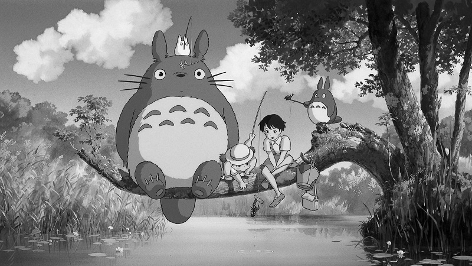               |
| Binary                                   |                |
| Index-color                              | 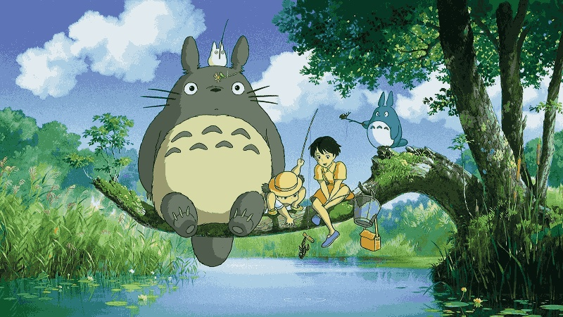               |
| Resizing to double without interpolation |  |
| Resizing to half without interpolation   |      |
| Resizing to double wit interpolation     | 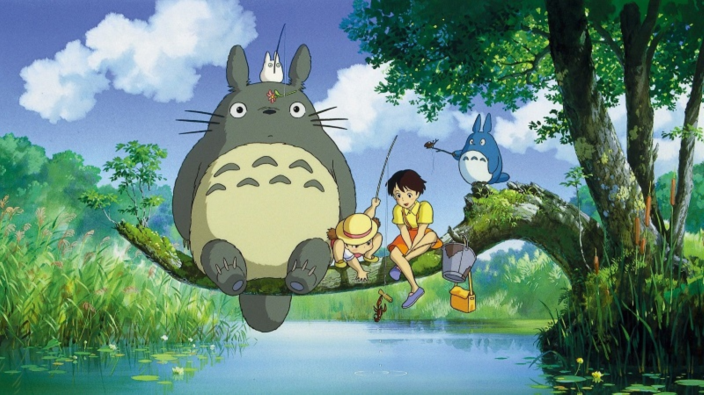 |
| Resizing to half with interpolation      | 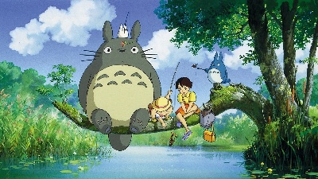     |

### Image 2

| Image type                               | Image                                                            |
| ---------------------------------------- | ---------------------------------------------------------------- |
| Input                                    | 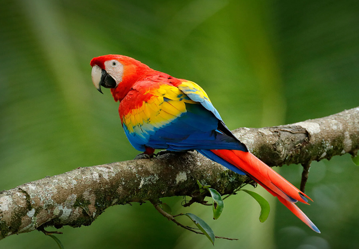                            |
| Grayscale                                | 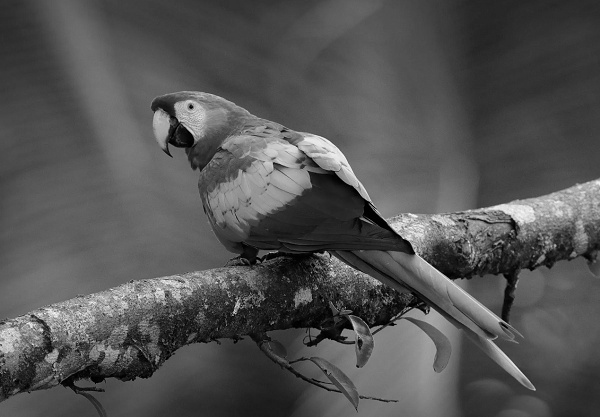               |
| Binary                                   | 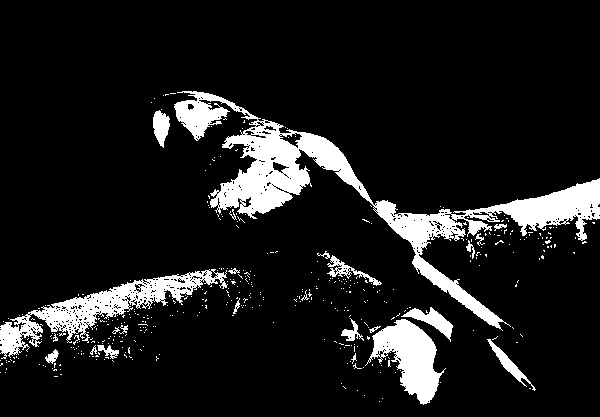               |
| Index-color                              | 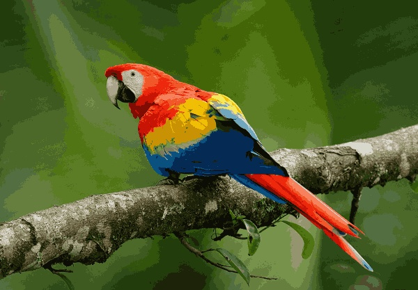               |
| Resizing to double without interpolation |  |
| Resizing to half without interpolation   |      |
| Resizing to double wit interpolation     |  |
| Resizing to half with interpolation      | 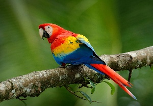     |

### Image 3

| Image type                               | Image                                                            |
| ---------------------------------------- | ---------------------------------------------------------------- |
| Input                                    |                             |
| Grayscale                                | 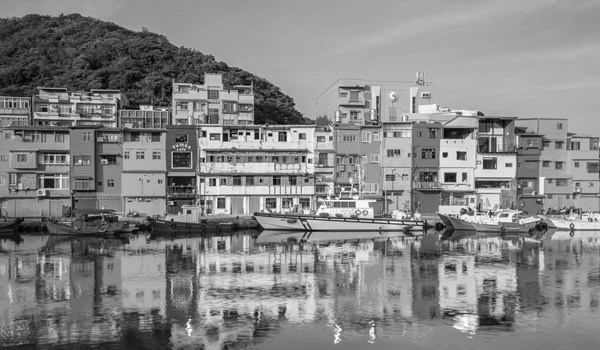               |
| Binary                                   | 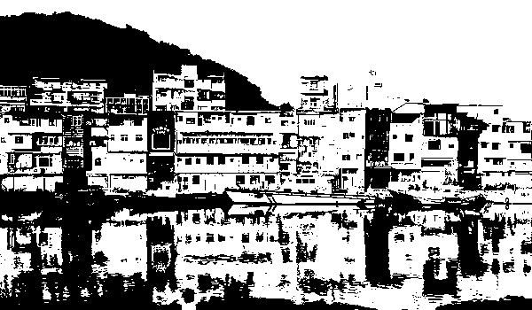               |
| Index-color                              | 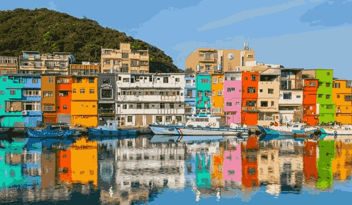               |
| Resizing to double without interpolation |  |
| Resizing to half without interpolation   | 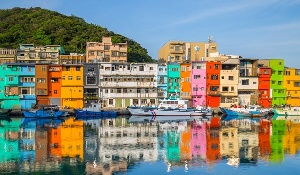     |
| Resizing to double wit interpolation     |  |
| Resizing to half with interpolation      |      |

## Observation and Discussion

1. OpenCV does not support 1-bit depth images. So binary images are still saved at 8-bit depth. The file size is not reduced.
2. Bilinear interpolation is smoother in detail than resize without interpolation.
3. The pictures generated by Index-color have a different kind of beauty, even though the details are lost. Looks good for coloring games.
