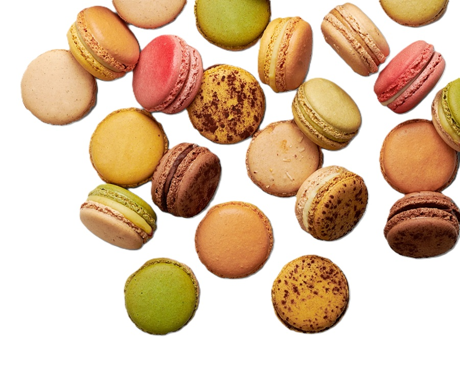
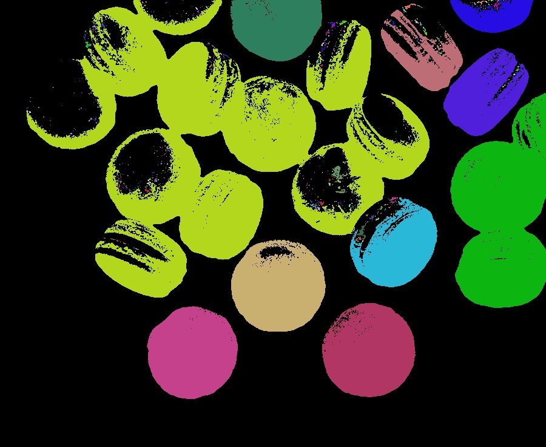
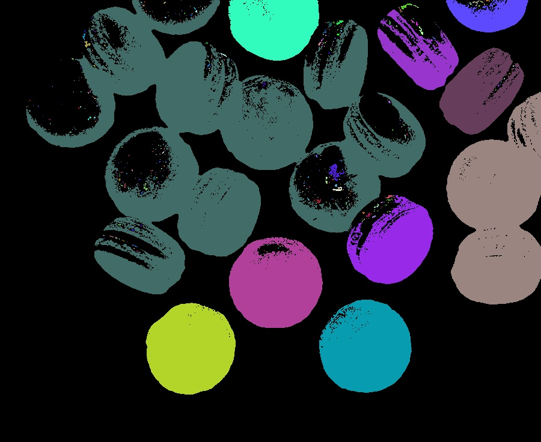
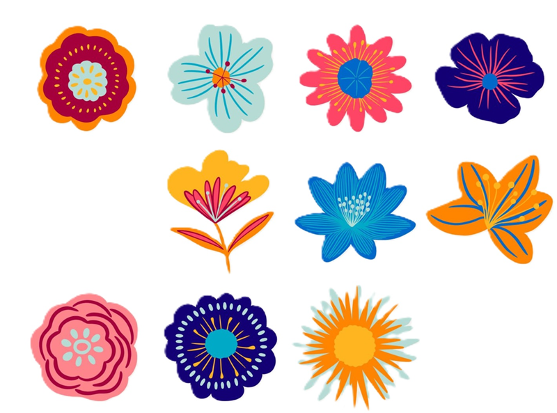
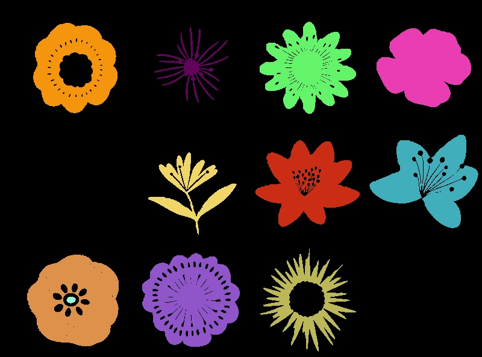
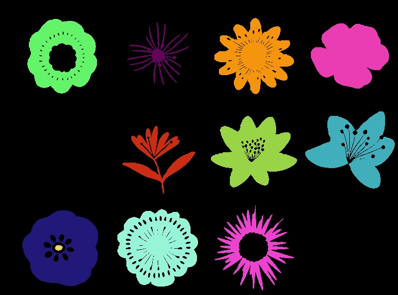

# Homework 1 Report

## Student Information

**Student ID:** 111590012

**Name:** 林品緯

## Methodology

### Question 1

- Q1
  - Convert the image to grey scale and continue to use the threshold found by `iterative_threshold` to convert the image to a binary image with a background of 0. Implement the **Sequential Algorithm (Labeling)** from the previous lesson and provide a parameter to switch between 4-connected and 8-connected, and finally map different labels to different colours.

### Question 2

- Q2

  - Calculate the amount of E and I in the picture. Use (E-I)/4 to calculate the number of objects.

> The external corner patterns (E) are 2´2 masks that have three 0’s and one 1-pixel<br>
> The internal corner patterns (I) are 2´2 masks that have three 1’s and one 0-pixel

## Results

### Image 1

| Image type                     | Image                              |
| ------------------------------ | ---------------------------------- |
| Input                          |        |
| Component Labeling 4-connected |  |
| Component Labeling 8-connected |  |

### Image 2

<table>
<tr>
<th>Image type</th>
<th>Image</th>
</tr>
<tr>
<td>Input</td>
<td></td>
</tr>
<tr>
<td>Component Labeling 4-connected</td>
<td></td>
</tr>
<tr>
<td> Component Labeling 8-connected</td>
<td></td>
</tr>
<tr>
<td>Object counting output</td>
<td>

```
===========img2.jpg===========
Internal Count: 13244
External Count: 10774
Object Count: -617.5
```

</td>
</tr>
</table>

### Image 3

<table>
<tr>
<th>Image type</th>
<th>Image</th>
</tr>
<tr>
<td>Input</td>
<td></td>
</tr>
<tr>
<td>Component Labeling 4-connected</td>
<td></td>
</tr>
<tr>
<td> Component Labeling 8-connected</td>
<td></td>
</tr>
<tr>
<td>Object counting output</td>
<td>

```
===========img3.jpg===========
Internal Count: 6133
External Count: 4507
Object Count: -406.5
```

</td>
</tr>
</table>

## Observation and Discussion

1. The Counting Objects algorithm is incorrect for images with objects containing holes.
<!-- 2. Iterative threshold is not applicable in all cases. Because the background of this time image is white. Instead of using iterative_threshold to determine the threshold. I'd rather just give it 250. -->
