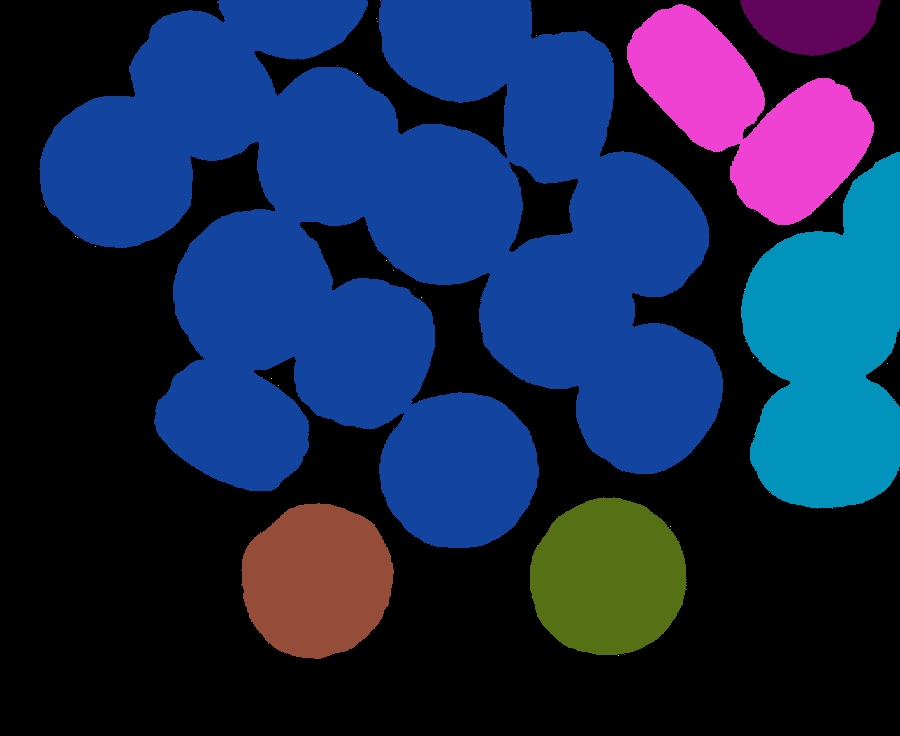
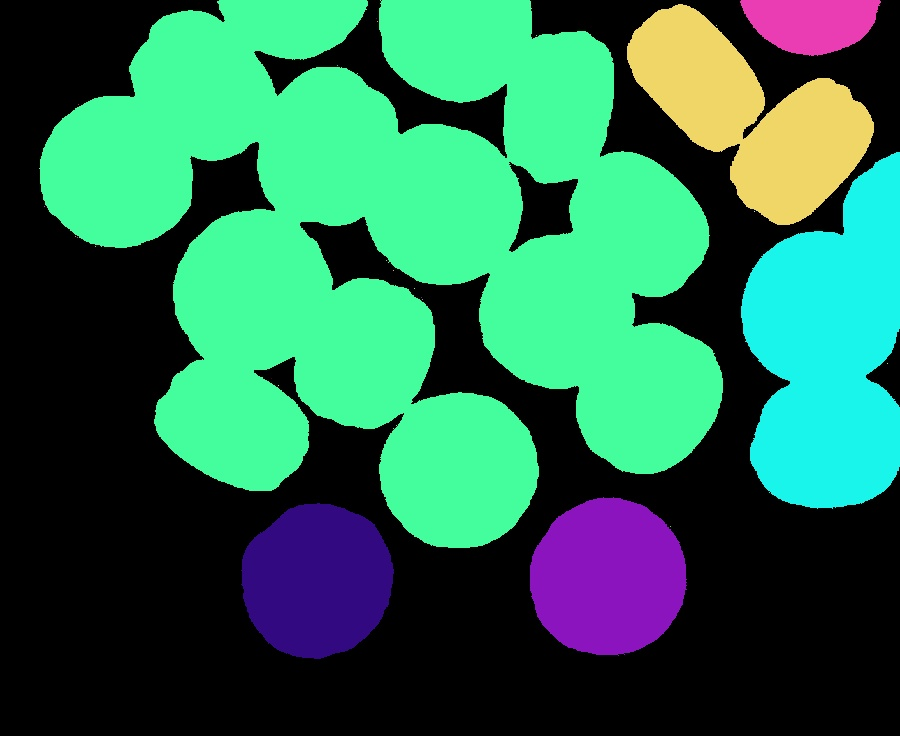
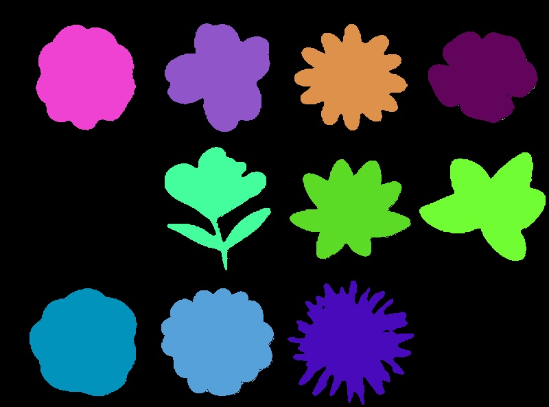
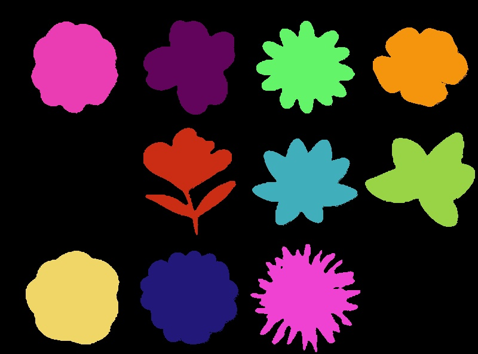

# Homework 1 Report

## Student Information

**Student ID:** 111590012

**Name:** 林品緯

## Methodology

### Question 1

- Q1
  - Convert the image to grey scale and continue to use the threshold found by `iterative_threshold` to convert the image to a binary image with a background of 0. Implement the **Sequential Algorithm (Labeling)** from the previous lesson and provide a parameter to switch between 4-connected and 8-connected, and finally map different labels to different colours.

### Question 2

- Q2

  - Calculate the amount of E and I in the picture. Use (E-I)/4 to calculate the number of objects.

> The external corner patterns (E) are 2´2 masks that have three 0’s and one 1-pixel<br>
> The internal corner patterns (I) are 2´2 masks that have three 1’s and one 0-pixel

## Results

### Image 1

| Item                                 | Iterative threshold                | Fixed threshold (250)                                        |
| ------------------------------------ | ---------------------------------- | ------------------------------------------------------------ |
| Input image                          |        |                                  |
| Component Labeling 4-connected image |  |  |
| Component Labeling 8-connected imag  |  |  |

### Image 2

<table>
<tr>
<th>Item</th>
<th>Iterative threshold </th>
<th>Fixed threshold (250)</th>
</tr>
<tr>
<td>Input image </td>
<td></td>
<td></td>
</tr>
<tr>
<td>Component Labeling 4-connected image</td>
<td></td>
<td></td>
</tr>
<tr>
<td>Component Labeling 8-connected image</td>
<td></td>
<td></td>
</tr>
<tr>
<td>Object counting output</td>
<td>

```
===========img2.jpg===========
Internal Count: 13244
External Count: 10774
Object Count: -617.5
```

</td>
<td>

```
===========img2.jpg===========
Internal Count: 2794
External Count: 2906
Object Count: 28.0
```

</td>
</tr>
</table>

### Image 3

<table>
<tr>
<th>Item</th>
<th>Iterative threshold </th>
<th>Fixed threshold (250)</th>
</tr>
<tr>
<td>Input image </td>
<td></td>
<td></td>
</tr>
<tr>
<td>Component Labeling 4-connected image</td>
<td></td>
<td></td>
</tr>
<tr>
<td>Component Labeling 8-connected image</td>
<td></td>
<td></td>
</tr>
<tr>
<td>Object counting output</td>
<td>

```
===========img3.jpg===========
Internal Count: 6133
External Count: 4507
Object Count: -406.5
```

</td>
<td>

```
===========img3.jpg===========
Internal Count: 2633
External Count: 2635
Object Count: 0.5
```

</td>
</tr>
</table>

## Observation and Discussion

1. The Counting Objects algorithm is incorrect for images with objects containing holes.
2. Iterative thresholding is not applicable in all cases, especially when the background of the image is white. Instead of using iterative thresholding, I prefer to use a fixed threshold in this case.
