# Homework 3 Report

## Student Information

**Student ID:** 111590012

**Name:** 林品緯

## Methodology

### Question 1

- Q1-1
  - Use **OpenCV**'s `MouseCallback` to implement drawing. Save the result of overlaying the drawn layer onto the original image. Also record the color index used for the drawn layer.
- Q1-2
  - Use **Watershed Segmentation** for the colou index image from the previous step. Merge the segmentation result with the original image with the specified transparency and save it.

## Results

### Image 1

| Item               | Image                                  |
| ------------------ | -------------------------------------- |
| Input image        | 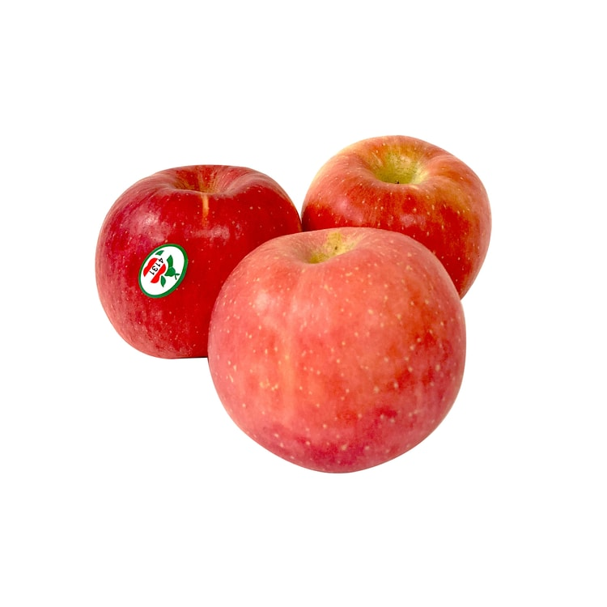           |
| Marked image       | 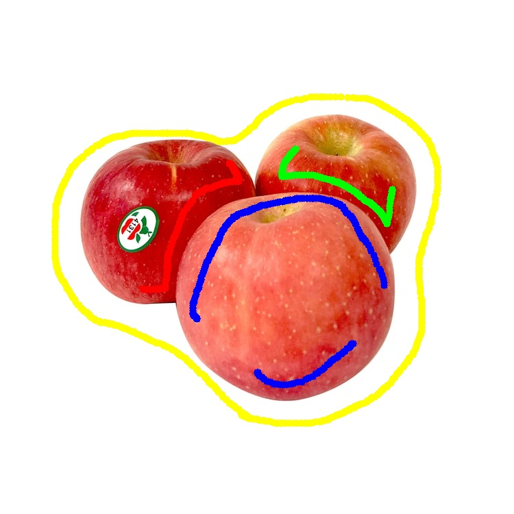  |
| Mask image         | 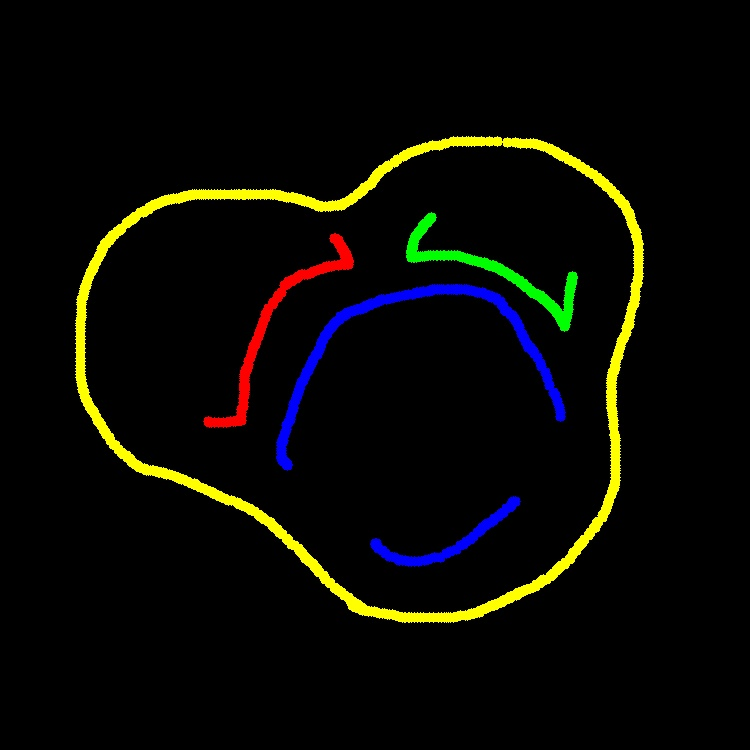    |
| Segsegmented image | 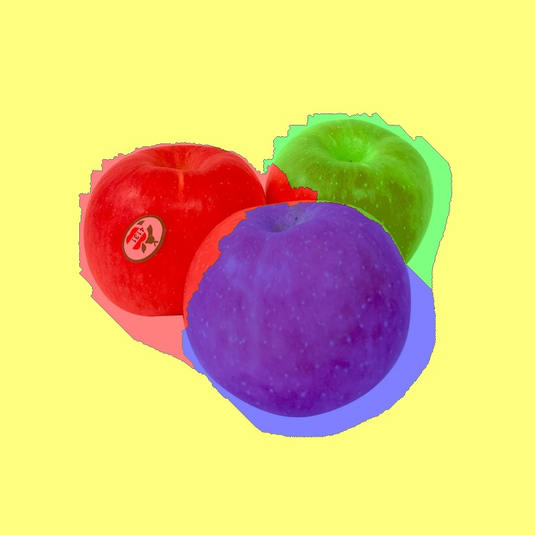     |
| Heatmap image      | 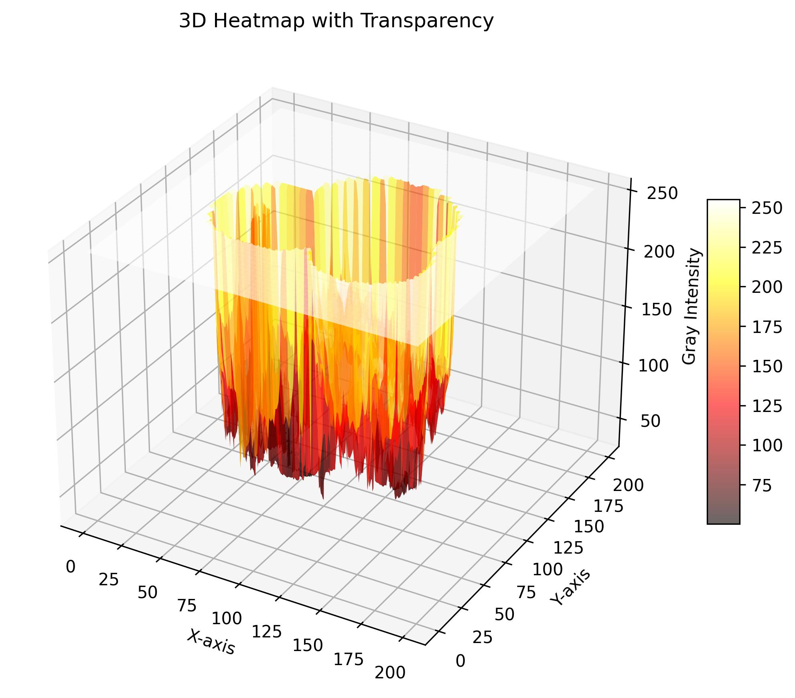 |

### Image 2

| Item               | Image                                  |
| ------------------ | -------------------------------------- |
| Input image        | 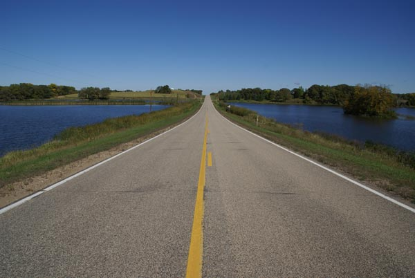           |
| Marked image       | 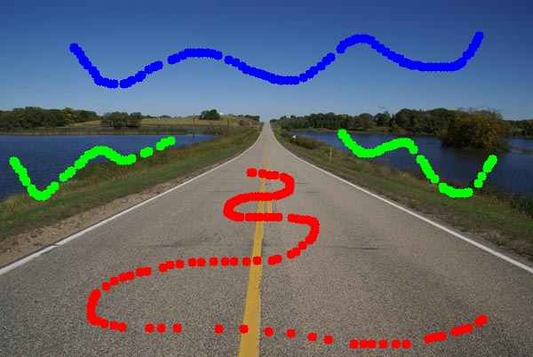  |
| Mask image         | 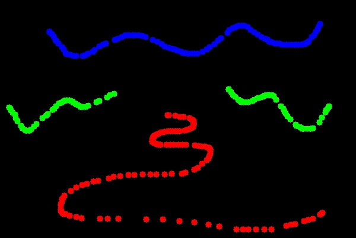    |
| Segsegmented image | 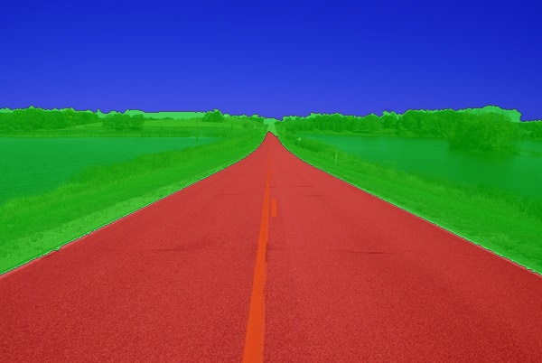     |
| Heatmap image      | 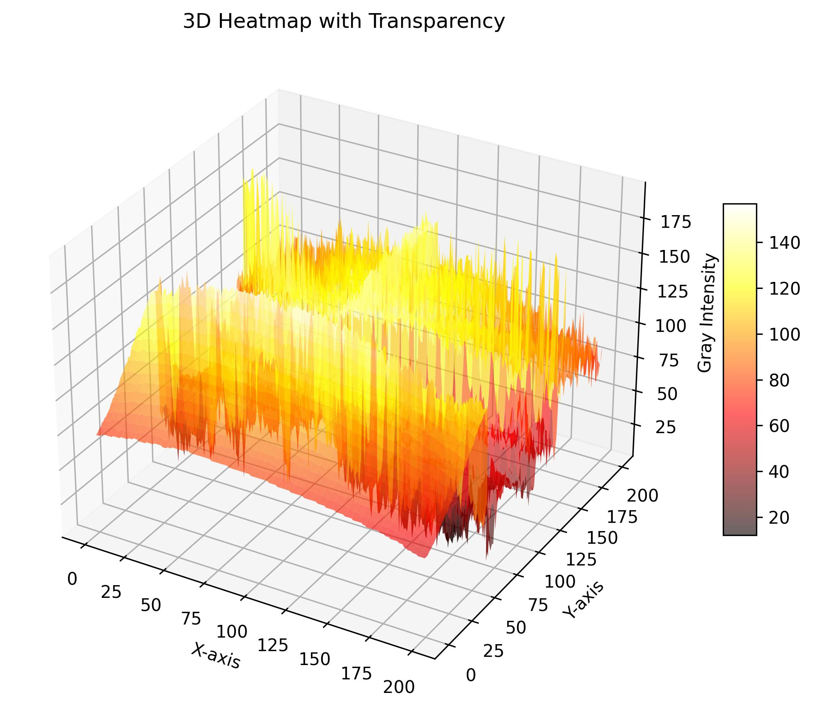 |

### Image 3

| Item               | Image                                  |
| ------------------ | -------------------------------------- |
| Input image        |            |
| Marked image       | 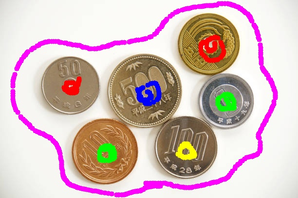  |
| Mask image         | 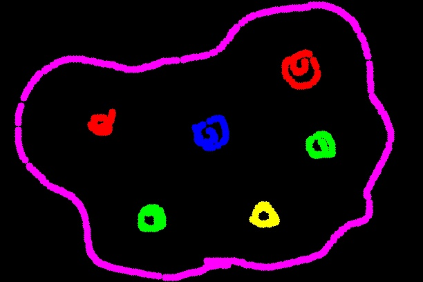    |
| Segsegmented image | 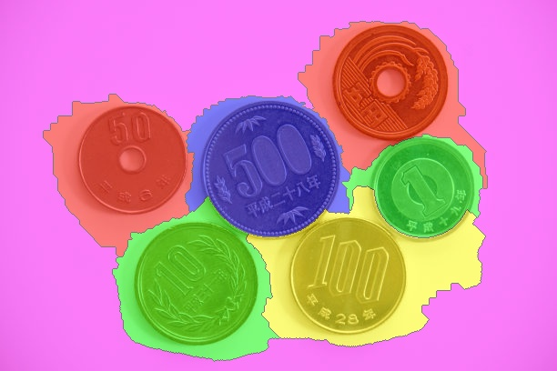     |
| Heatmap image      | 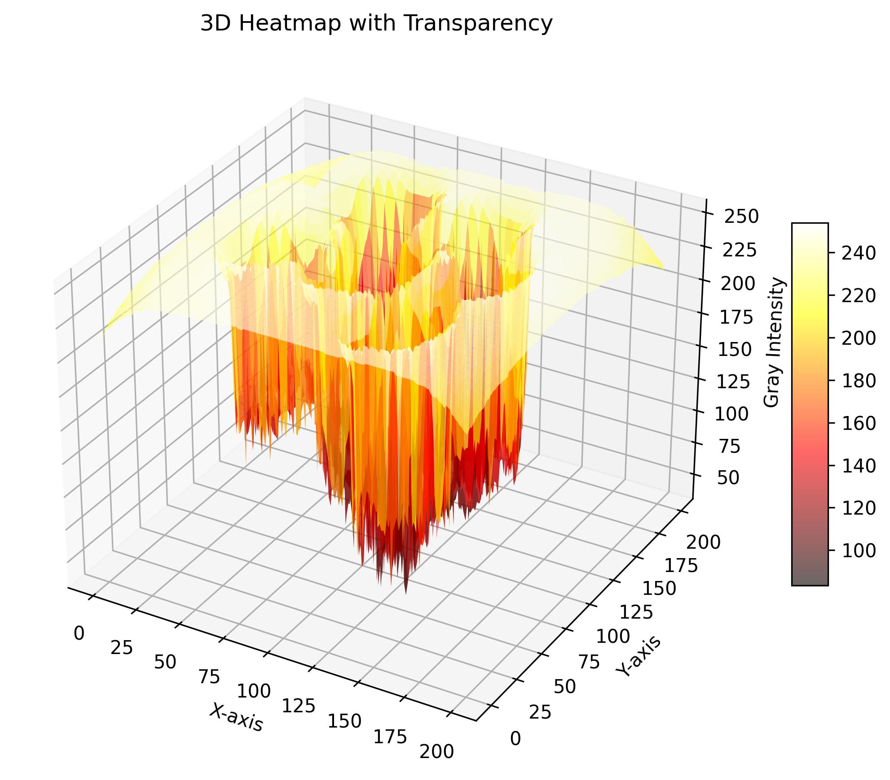 |

## Observation and Discussion

1. Image 2 looks the best after segmentation. According to the heatmap, this may be due to the higher intensity peaks observed between segmented regions.
2. Some segments in areas with a white background tend to extend into the background. To improve this, the background could be labeled as a separate category before applying the Watershed Segmentation.
