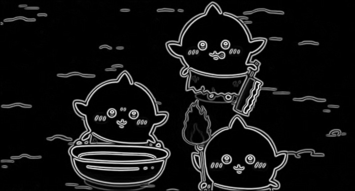

# Homework 4 Report

## Student Information

**Student ID：** 111590012

**Name：** 林品緯

## Methodology

### Question 1

1. **Gaussian Filtering**  
   A Gaussian blur is applied to the input image using a manually created Gaussian kernel. Kernel size is set to 5. $\sigma$ is set to 1.0.
   This step smooths the image and reduces noise, which helps prevent false edge detection in later stages.

2. **Sobel Gradient Calculation**  
    Image gradients are computed using Sobel operators in both the x and y directions.  
    This yields two outputs for each pixel：

   - Gradient magnitude (represents edge strength)
   - Gradient direction (represents edge orientation)

   soble x： 
   [[-1, 0, 1], 
[ -2, 0, 2], 
[-1, 0, 1]] 

   soble y： 
   [[1, 2, 1], 
[ 0, 0, 0], 
[-1, -2, -1]] 

3. **Non-Maximum Suppression (NMS)**  
   To produce thin and accurate edges, non-maximum suppression is applied.  
   Each pixel's gradient magnitude is compared to its neighbors in the gradient direction.  
   Only local maxima are retained; others are suppressed (set to 0).

4. **Double Thresholding**  
   Pixels are classified into three categories based on their gradient magnitudes：

   - **Strong edges**： greater than the high threshold
   - **Weak edges**： between high and low thresholds
   - **Non-edges**： below the low threshold (removed)

5. **Edge Tracking by Hysteresis**  
   Weak edges are kept **only if** they are connected to strong edges.  
   This step removes spurious weak edges caused by noise and keeps only meaningful edge structures.

## Results

### Image 1

| Item            | Image                                    |
| --------------- | ---------------------------------------- |
| Input image     |              |
| Gaussian image  |   |
| Magnitude image |  |
| Canny image     |     |

### Image 2

| Item            | Image                                    |
| --------------- | ---------------------------------------- |
| Input image     |              |
| Gaussian image  |   |
| Magnitude image |  |
| Canny image     |     |

### Image 3

| Item            | Image                                    |
| --------------- | ---------------------------------------- |
| Input image     |              |
| Gaussian image  |   |
| Magnitude image |  |
| Canny image     |     |

## Observation and Discussion

1. In the presentation slide, the Sobel Y kernel appears to be vertically flipped. The correct Sobel Y operator should be： 
   [[1, 2, 1], 
[ 0, 0, 0], 
[-1, -2, -1]] 
   However, the one shown in the slide seems to be： 
   [[-1, -2, -1], 
[ 0, 0, 0], 
[ 1, 2, 1]] 
   This reversal causes the gradient direction to be inverted along the vertical axis, which may lead to incorrect edge direction classification. It’s important to verify the kernel orientation when implementing or presenting gradient-based methods like Sobel.
